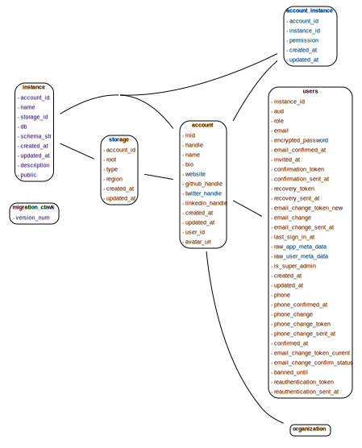
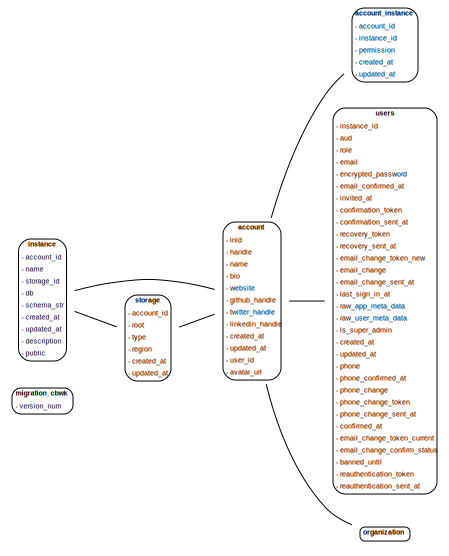
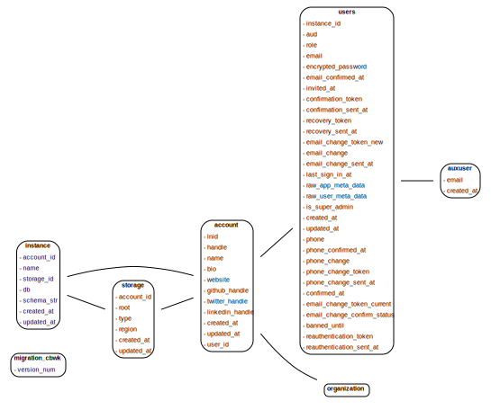

# Migrations

1. Set env: `export LN_SERVER_DEPLOY=1` (it tells `lnhub_rest` that the server-side admin connection string is available)
2. Modify the schema by rewriting the ORMs (add a column, rename a column, add constraints, drop constraints, add an ORM, etc.)
3. Auto-generate the migration script: `alembic --config lnhub_rest/schema/alembic.ini --name cbwk revision --autogenerate -m "vX.X.X"`
4. Thoroughly test the migration script: `pytest tests/test_migrations.py` (is also run on CI)
5. Make an entry in below table and deploy migration to production database: `alembic --config lnhub_rest/schema/alembic.ini --name cbwk upgrade head`

| Date       | Migration    | Version | Developer | Notes                                                                                                            | Schema                                        |
| ---------- | ------------ | ------- | --------- | ---------------------------------------------------------------------------------------------------------------- | --------------------------------------------- |
| 2023-02-08 | e7eef9775586 | 0.2.1   | Fred      | [PR75](https://github.com/laminlabs/lnhub-rest/pull/75)                                                          |  |
| 2023-02-06 | 9c02109e4faa | 0.2.0   | Alex      | [PR66](https://github.com/laminlabs/lnhub-rest/pull/66)                                                          | unchanged                                     |
| 2023-02-06 | fe962c9a0ae7 |         | Fred      | [PR65](https://github.com/laminlabs/lnhub-rest/pull/65)                                                          |  |
| 2023-02-06 | 95073282294e |         | Fred      | [PR63](https://github.com/laminlabs/lnhub-rest/pull/63)                                                          |
| 2023-02-06 | f2cb77148a6e |         | Fred      | [PR61](https://github.com/laminlabs/lnhub-rest/pull/61)                                                          |  |
| 2023-01-30 | 2efe1dee9baf |         | Fred      | [PR56](https://github.com/laminlabs/lnhub-rest/pull/56)                                                          |
| 2023-01-24 | e7151581f790 |         | Fred      | [PR49](https://github.com/laminlabs/lnhub-rest/pull/49)                                                          |  |
| 2023-01-23 | c13c9dd0f3ae |         | Alex      | [PR47](https://github.com/laminlabs/lnhub-rest/pull/47)                                                          |  |
| 2023-01-14 | f7ba9352c706 | 0.0.2   | Alex      | [PR28](https://github.com/laminlabs/lnhub-rest/pull/28)                                                          |  |
| 2023-01-13 | c555c87a640c | 0.0.1   | Alex      | [PR23](https://github.com/laminlabs/lnhub-rest/pull/23), [PR26](https://github.com/laminlabs/lnhub-rest/pull/26) |
| 2023-01-13 | 53709f2a2043 | -       | Alex      | [PR23](https://github.com/laminlabs/lnhub-rest/pull/23), [PR26](https://github.com/laminlabs/lnhub-rest/pull/26) |
